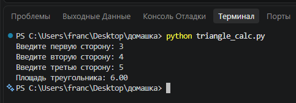
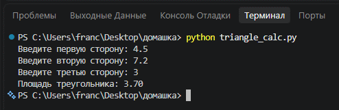
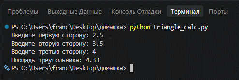
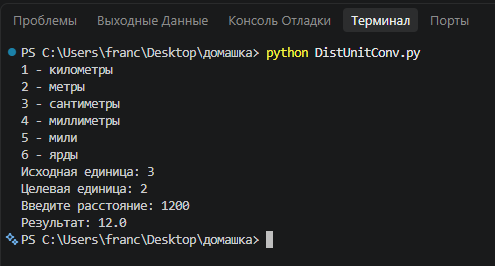
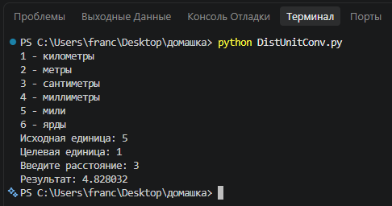
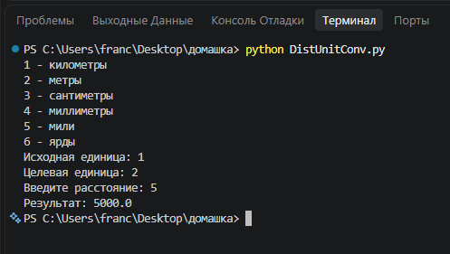
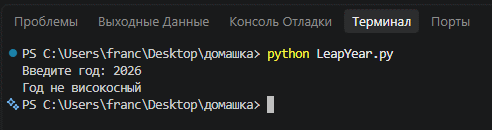
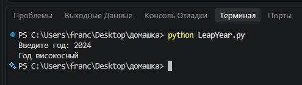
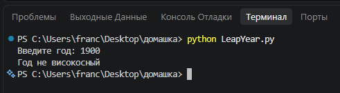

# Исполнитель

Дроган Никита Андреевич

Группа: Фт-250007

# Лабораторная работа №1 – Функции ввода/вывода, условный оператор

## Формулировка задания

Разработать программы с использованием функций ввода/вывода и условных операторов.

Выполнены следующие задания:

- Вычисление площади треугольника по формуле Герона.
- Конвертер единиц измерения расстояния.
- Определение високосного года.

# Среда разработки

Язык программирования: Python.

Среда разработки: Visual Studio Code.

Файлы проекта:

- `TringleCalc.py`
- `DistUnitConv.py`
- `LeapYear.py`

# Запуск программы

- Открыть папку проекта в Visual Studio Code.
- Открыть нужный Python-файл.
- Запустить программу через Run Python File.
- Ввести данные согласно запросам программы.

# Результаты тестирования

## Задание 1. Площадь треугольника

### Тест 1

### Тест 2

### Тест 3

## Задание 2. Конвертер расстояний

### Тест 1

### Тест 2

### Тест 3

## Задание 3. Високосный год

### Тест 1

### Тест 2

### Тест 3

